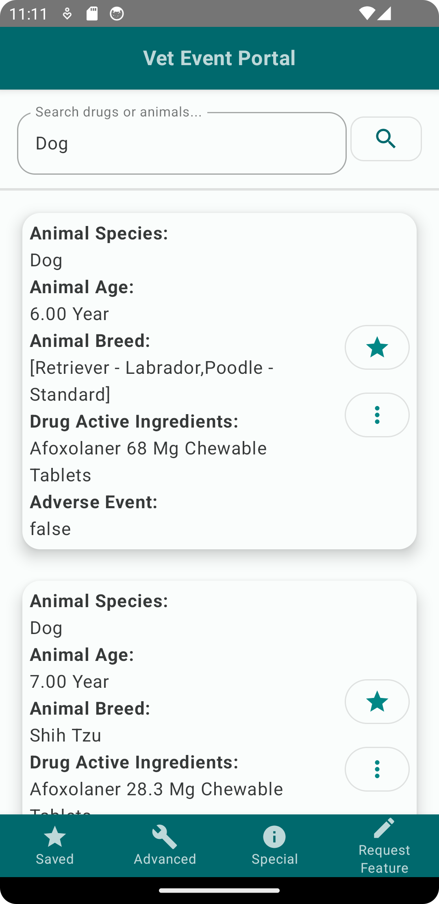

## App Overview

Vet Event Portal is an open source app built using the Kotlin Multiplatform framework targeting
Android, iOS and Desktop platforms. Vet Event Portal provides an interface for users to search
for data uploaded to the public openFDA API service. Users can lookup adverse events for different
animals or drug active ingredients.

This project used the following packages and libraries:

* Precompose - Navigation and ViewModel
* Kotlin-inject - Dependency Injection
* Ktor - Http Client
* SqlDelight - Offline SQL database

## In Action

